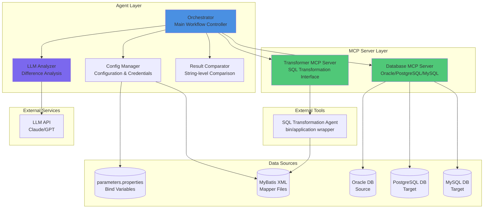
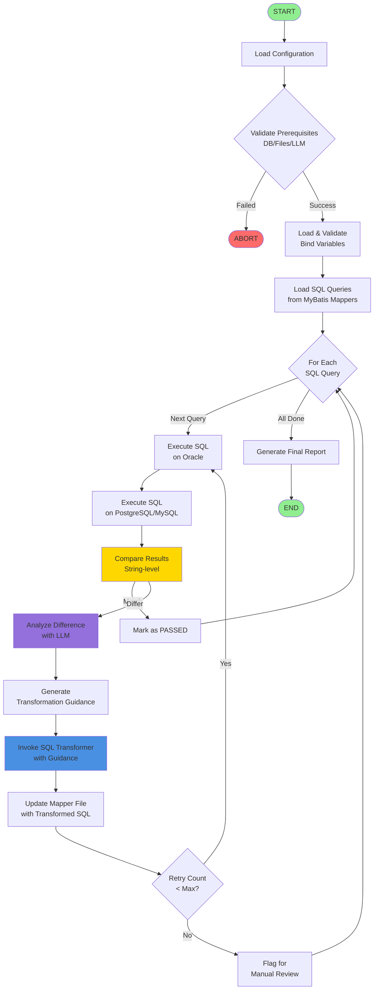
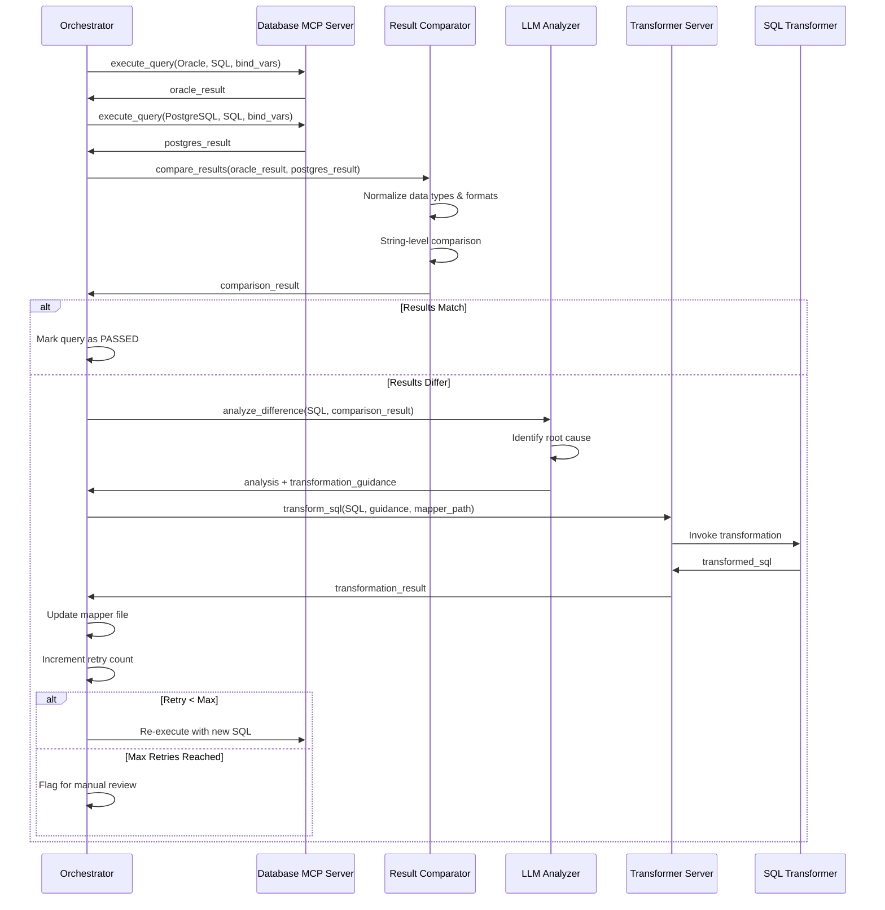
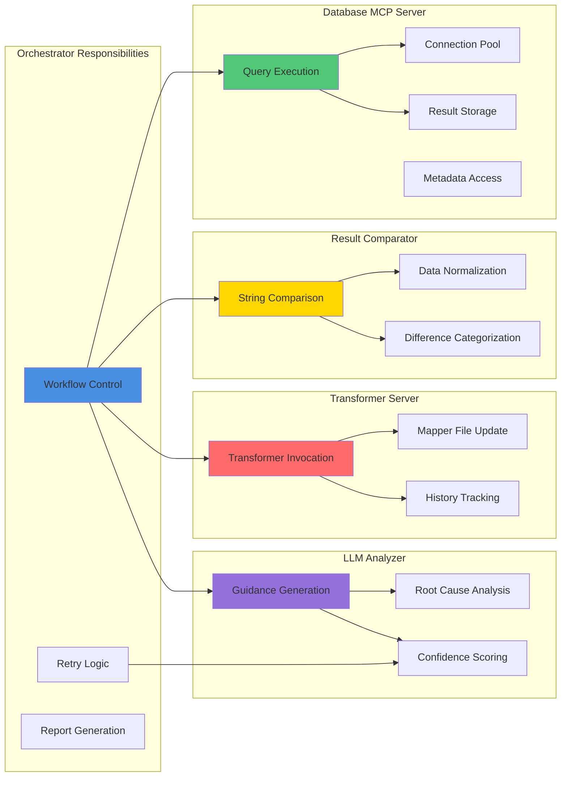
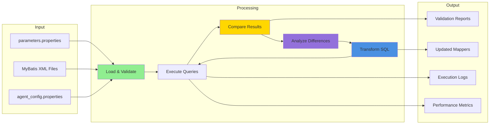
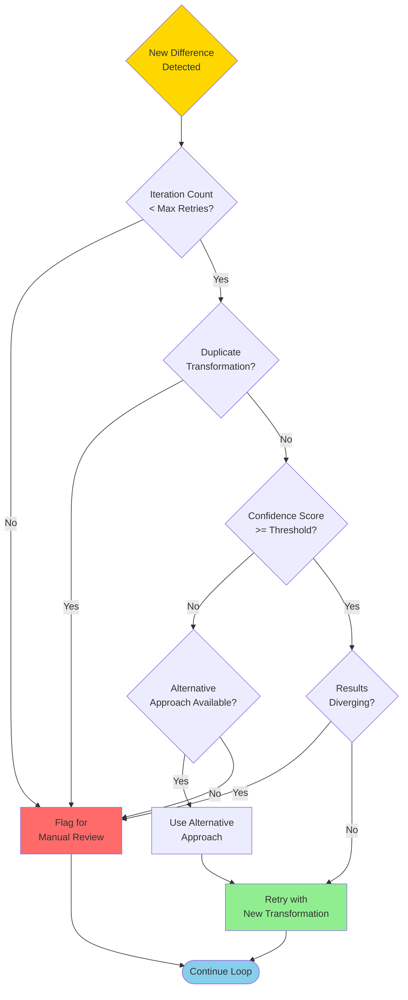
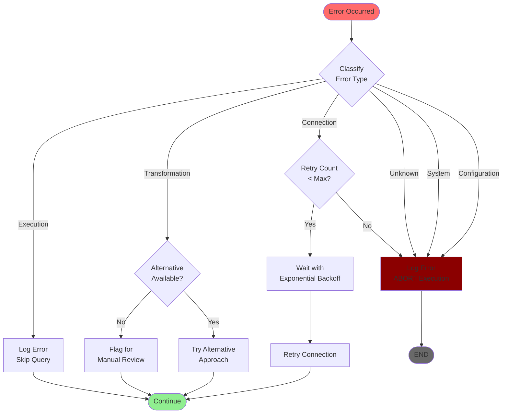
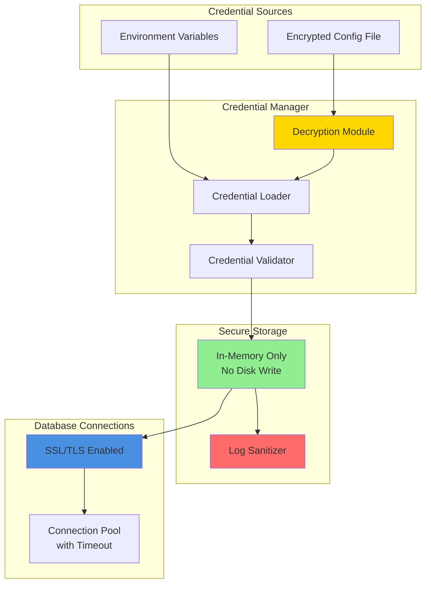
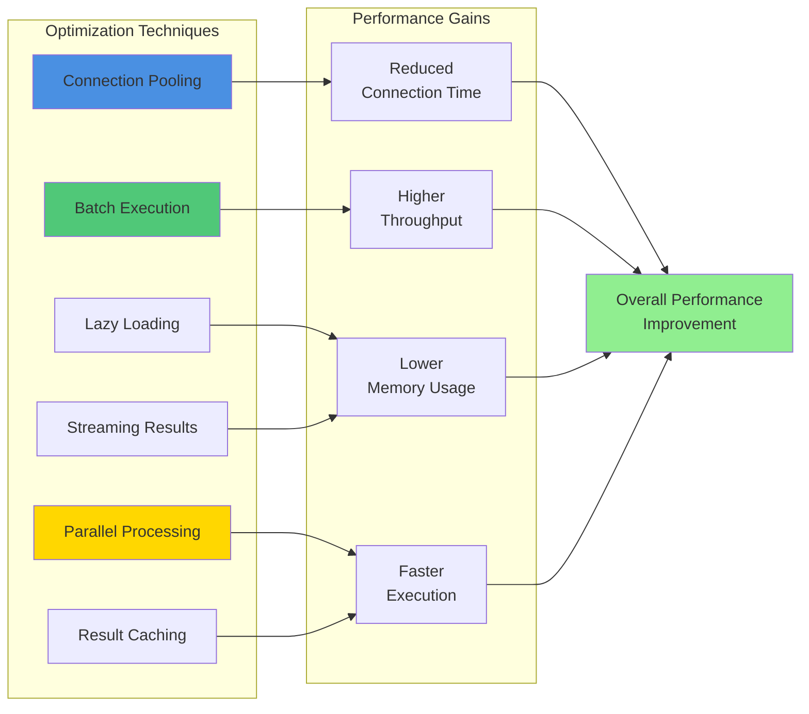
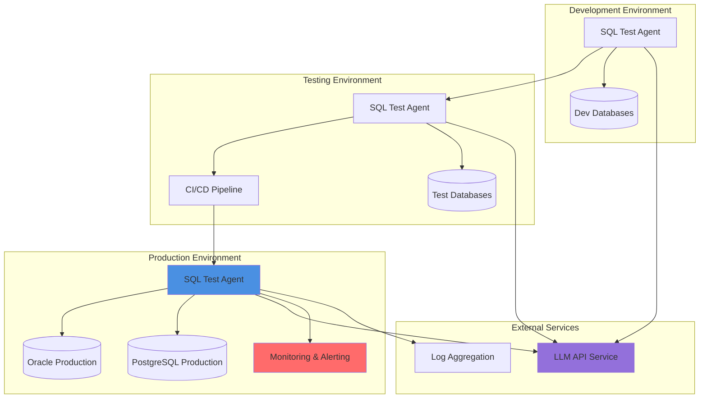

# SQL Test Agent - Architecture Diagrams

## 1. System Architecture Overview

## 2. Main Validation Workflow

## 3. Detailed Validation Loop

## 4. Component Interaction Diagram

## 5. Data Flow Diagram

## 6. Retry Strategy Decision Tree

## 7. Error Handling Flow

## 8. Security Architecture

## 9. Performance Optimization Strategy

## 10. Deployment Architecture

