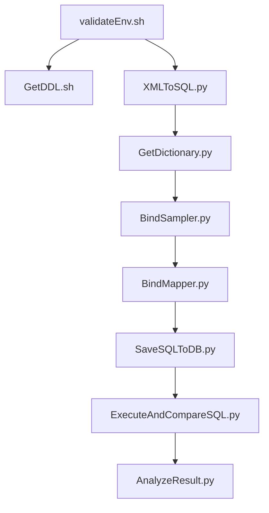

# Oracle Migration Assistant (OMA)

Oracle 데이터베이스에서 PostgreSQL로의 마이그레이션을 지원하는 종합적인 도구 모음입니다.

## 📋 목차

- [프로그램 개요](#프로그램-개요)
- [실행 순서](#실행-순서)
- [환경 설정](#환경-설정)
- [디렉토리 구조](#디렉토리-구조)
- [설치 및 설정](#설치-및-설정)
- [사용법](#사용법)
- [문제 해결](#문제-해결)

## 🔧 프로그램 개요

### 1. **validateEnv.sh** - 환경 검증 도구
- **목적**: 모든 프로그램 실행 전 환경 검증
- **기능**: 
  - 환경변수 설정 확인
  - 데이터베이스 연결 테스트
  - 프로그램 의존성 검사
  - 파일 권한 확인
- **출력**: 검증 보고서 및 로그

### 2. **GetDDL.sh** - DDL 추출 도구
- **목적**: Oracle과 PostgreSQL에서 테이블 DDL 추출
- **기능**:
  - Oracle 테이블 DDL 추출
  - PostgreSQL 테이블 DDL 추출
  - 샘플 데이터 포함
  - 통합 DDL 파일 생성
- **출력**: 테이블별 DDL 파일

### 3. **XMLToSQL.py** - SQL 추출 도구
- **목적**: MyBatis XML 매퍼에서 SQL 문 추출
- **기능**:
  - XML 리스트 파일 관리
  - SQL 문 파싱 및 추출
  - 개별 SQL 파일 생성
  - 처리 요약 보고서 생성
- **출력**: 개별 SQL 파일들

### 4. **GetDictionary.py** - 데이터베이스 딕셔너리 생성
- **목적**: Oracle 데이터베이스 메타데이터 추출
- **기능**:
  - 테이블/컬럼 정보 수집
  - 샘플 데이터 추출
  - 데이터 타입 분석
  - JSON 딕셔너리 생성
- **출력**: 통합 데이터베이스 딕셔너리

### 5. **BindSampler.py** - 바인드 변수 샘플링
- **목적**: SQL 바인드 변수에 대한 샘플 값 생성
- **기능**:
  - 바인드 변수 식별
  - 데이터 타입별 샘플 값 생성
  - 실제 데이터 기반 샘플링
  - JSON 샘플 파일 생성
- **출력**: 바인드 변수 샘플 파일들

### 6. **BindMapper.py** - 바인드 변수 매핑
- **목적**: SQL의 바인드 변수를 실제 값으로 대체
- **기능**:
  - 바인드 변수 대체
  - Oracle/PostgreSQL 형식 지원
  - 데이터 타입별 포맷팅
  - 실행 가능한 SQL 생성
- **출력**: 실행 가능한 SQL 파일들

### 7. **SaveSQLToDB.py** - SQL 메타데이터 저장
- **목적**: SQL 파일들을 데이터베이스 테이블에 저장
- **기능**:
  - SQL 파일 스캔 및 분석
  - sqllist 테이블 생성/업데이트
  - 메타데이터 추출
  - CSV 내보내기
- **출력**: PostgreSQL sqllist 테이블 및 CSV 파일

### 8. **ExecuteAndCompareSQL.py** - SQL 실행 및 비교
- **목적**: Oracle과 PostgreSQL에서 SQL 실행 후 결과 비교
- **기능**:
  - 양쪽 DB에서 SQL 실행
  - 결과 비교 및 분석
  - 성능 메트릭 수집
  - 종합 보고서 생성
- **출력**: 실행 결과 및 비교 보고서

### 9. **AnalyzeResult.py** - 결과 분석 도구
- **목적**: SQL 실행 결과의 차이점 종합 분석
- **기능**:
  - 다중 소스 데이터 통합
  - 차이 유형 분류 및 분석
  - 트렌드 분석
  - 자동 권장사항 생성
- **출력**: HTML/JSON/CSV 분석 보고서

## 🔄 실행 순서



### 단계별 실행 순서

1. **환경 검증** (`validateEnv.sh`)
   ```bash
   ./validateEnv.sh
   ```

2. **DDL 추출** (`GetDDL.sh`)
   ```bash
   ./GetDDL.sh
   ```

3. **SQL 추출** (`XMLToSQL.py`)
   ```bash
   # XML 리스트 파일 생성 (별도 실행)
   python3 FindXMLFiles.py /path/to/xml/files --orcl
   python3 FindXMLFiles.py /path/to/xml/files --pg
   
   # SQL 추출
   python3 XMLToSQL.py
   ```

4. **딕셔너리 생성** (`GetDictionary.py`)
   ```bash
   python3 GetDictionary.py
   ```

5. **바인드 샘플링** (`BindSampler.py`)
   ```bash
   python3 BindSampler.py
   ```

6. **바인드 매핑** (`BindMapper.py`)
   ```bash
   python3 BindMapper.py
   ```

7. **SQL 저장** (`SaveSQLToDB.py`)
   ```bash
   python3 SaveSQLToDB.py
   ```

8. **SQL 실행 및 비교** (`ExecuteAndCompareSQL.py`)
   ```bash
   python3 ExecuteAndCompareSQL.py
   ```

9. **결과 분석** (`AnalyzeResult.py`)
   ```bash
   python3 AnalyzeResult.py
   ```

## ⚙️ 환경 설정

### 필수 환경변수

#### Oracle 연결 정보
```bash
export ORACLE_ADM_USER=system
export ORACLE_ADM_PASSWORD=password
export ORACLE_SVC_USER=service_user
export ORACLE_SVC_PASSWORD=password
export ORACLE_SVC_CONNECT_STRING=localhost:1521/orcl
export ORACLE_SID=orcl
```

#### PostgreSQL 연결 정보
```bash
export PGHOST=localhost
export PGPORT=5432
export PGDATABASE=postgres
export PGUSER=postgres
export PGPASSWORD=password
```

#### 작업 디렉토리
```bash
export TEST_FOLDER=/path/to/work/directory
export TEST_LOGS_FOLDER=/path/to/logs/directory
```

### 선택적 환경변수
```bash
export SQL_BATCH_SIZE=10
export SQL_PARALLEL_EXECUTION=false
export SQL_MAX_WORKERS=4
export SQL_TEMP_CLEANUP=true
export SQL_ARCHIVE_DAYS=7
```

## 📁 디렉토리 구조

### 전체 디렉토리 구조
```
$TEST_FOLDER/
├── tab_ddl/                                # GetDDL.sh 출력
│   ├── table1.sql                         # Oracle + PostgreSQL DDL
│   ├── table2.sql
│   └── ...
├── xmllist/                                # XMLToSQL.py 관리
│   ├── orcl_xml.lst                       # Oracle XML 파일 목록
│   ├── pg_xml.lst                         # PostgreSQL XML 파일 목록
│   ├── backup/                            # 백업 파일들
│   │   ├── orcl_xml.lst.20240619_220000
│   │   └── pg_xml.lst.20240619_220000
│   └── processing_summary_20240619_220000.txt
├── orcl_sql_extract/                      # XMLToSQL.py 출력 (Oracle)
│   ├── UserMapper.selectUser.sql
│   ├── UserMapper.insertUser.sql
│   └── ...
├── pg_sql_extract/                        # XMLToSQL.py 출력 (PostgreSQL)
│   ├── UserMapper.selectUser.sql
│   ├── UserMapper.insertUser.sql
│   └── ...
├── dictionary/                             # GetDictionary.py 출력
│   └── all_dictionary.json               # 통합 데이터베이스 딕셔너리
├── sampler/                               # BindSampler.py 출력
│   ├── UserMapper.selectUser.json        # 바인드 변수 샘플
│   ├── UserMapper.insertUser.json
│   └── ...
├── orcl_sql_done/                         # BindMapper.py 출력 (Oracle)
│   ├── UserMapper.selectUser.sql         # 바인드 변수 대체된 SQL
│   ├── UserMapper.insertUser.sql
│   └── ...
├── pg_sql_done/                           # BindMapper.py 출력 (PostgreSQL)
│   ├── UserMapper.selectUser.sql
│   ├── UserMapper.insertUser.sql
│   └── ...
├── sqllist/                               # SaveSQLToDB.py 출력
│   ├── sqllist_20240619_220000.csv       # SQL 메타데이터 CSV
│   └── sqllist_summary_20240619_220000.txt
├── sql_results/                           # ExecuteAndCompareSQL.py 출력
│   ├── csv/                               # CSV 결과 파일들
│   │   ├── sql_comparison_results_20240619_220000.csv
│   │   ├── sql_comparison_results_S_20240619_220100.csv
│   │   └── sql_comparison_results_SUI_20240619_220200.csv
│   ├── summary/                           # 요약 보고서들
│   │   ├── execution_summary_20240619_220000.txt
│   │   ├── detailed_analysis_20240619_220000.json
│   │   └── execution_summary_S_20240619_220100.txt
│   ├── temp/                              # 임시 작업 디렉토리
│   │   ├── oracle/                        # Oracle 임시 파일들
│   │   │   ├── temp_sql_UserMapper.selectUser_20240619_220000_123456.sql
│   │   │   └── temp_sql_UserMapper.selectUser_20240619_220000_123456.sql_result.csv
│   │   ├── postgresql/                    # PostgreSQL 임시 파일들
│   │   │   └── temp_sql_UserMapper.selectUser_20240619_220000_123456.sql
│   │   └── cleanup/                       # 정리 실패한 파일들
│   │       └── failed_20240619_220000_temp_sql_001.sql
│   └── archive/                           # 아카이브 (향후 확장)
└── analysis_results/                      # AnalyzeResult.py 출력
    ├── html/                              # HTML 보고서들
    │   ├── difference_analysis_20240619_220000.html
    │   ├── difference_analysis_S_20240619_220100.html
    │   └── difference_analysis_app1_20240619_220200.html
    ├── json/                              # JSON 분석 데이터
    │   ├── analysis_data_20240619_220000.json
    │   └── analysis_data_S_20240619_220100.json
    ├── csv/                               # CSV 요약 데이터
    │   ├── difference_summary_20240619_220000.csv
    │   └── difference_summary_S_20240619_220100.csv
    └── assets/                            # 정적 자원들 (향후 확장)

$TEST_LOGS_FOLDER/
├── validate_env_20240619_220000.log       # validateEnv.sh 로그
├── xml_to_sql.log                         # XMLToSQL.py 로그
├── dictionary_extraction.log              # GetDictionary.py 로그
├── bind_sampler.log                       # BindSampler.py 로그
├── bind_mapper.log                        # BindMapper.py 로그
├── save_sql_to_db.log                     # SaveSQLToDB.py 로그
├── execute_and_compare_sql.log            # ExecuteAndCompareSQL.py 메인 로그
├── execute_and_compare_sql_debug.log      # ExecuteAndCompareSQL.py 디버그 로그
├── sql_execution_errors.log               # SQL 실행 오류 로그
├── performance_metrics.log                # 성능 메트릭 로그
└── analyze_result.log                     # AnalyzeResult.py 로그

PostgreSQL Database:
└── sqllist 테이블                         # SQL 메타데이터 및 실행 결과
    ├── sql_id, app_name, stmt_type        # 기본 정보
    ├── orcl, pg                           # SQL 내용
    ├── orcl_result, pg_result             # 실행 결과
    └── same                               # 결과 일치 여부
```

### 데이터 흐름도
```
GetDDL.sh → tab_ddl/*.sql

FindXMLFiles.py → orcl_xml.lst, pg_xml.lst
XMLToSQL.py → xmllist/ + orcl_sql_extract/ + pg_sql_extract/

GetDictionary.py → dictionary/all_dictionary.json

BindSampler.py → sampler/*.json
BindMapper.py → orcl_sql_done/ + pg_sql_done/

SaveSQLToDB.py → sqllist/ + PostgreSQL.sqllist

ExecuteAndCompareSQL.py → sql_results/

AnalyzeResult.py → analysis_results/
```

## 🛠️ 설치 및 설정

### 시스템 요구사항
- **운영체제**: Linux, macOS, Windows (WSL)
- **Python**: 3.6 이상
- **Oracle Client**: SQL*Plus 포함
- **PostgreSQL Client**: psql 포함
- **Java**: 8 이상 (선택사항)

### 필수 패키지 설치

#### CentOS/RHEL
```bash
sudo dnf update
sudo dnf install -y python3 python3-pip postgresql-client unzip jq curl
```

#### Ubuntu/Debian
```bash
sudo apt update
sudo apt install -y python3 python3-pip postgresql-client unzip jq curl
```

#### macOS
```bash
brew install python3 postgresql jq
```

### Python 패키지 설치
```bash
pip3 install psycopg2-binary cx_Oracle lxml pandas matplotlib jinja2
```

### Oracle Client 설치
1. Oracle Instant Client 다운로드
2. 환경변수 설정:
   ```bash
   export ORACLE_HOME=/path/to/oracle/client
   export PATH=$ORACLE_HOME/bin:$PATH
   export LD_LIBRARY_PATH=$ORACLE_HOME/lib:$LD_LIBRARY_PATH
   ```

## 🚀 사용법

### 1. 환경 검증
```bash
# 기본 검증
./validateEnv.sh

# 상세 출력
./validateEnv.sh -v

# 보고서 생성
./validateEnv.sh -r validation_report.txt
```

### 2. DDL 추출
```bash
# 모든 테이블 DDL 추출
./GetDDL.sh

# 상세 출력
./GetDDL.sh -v
```

### 3. SQL 추출
```bash
# XML 리스트 생성 (사전 작업)
python3 FindXMLFiles.py /path/to/xml/files --orcl
python3 FindXMLFiles.py /path/to/xml/files --pg

# 모든 XML에서 SQL 추출
python3 XMLToSQL.py

# 특정 DB만 처리
python3 XMLToSQL.py orcl
python3 XMLToSQL.py pg
```

### 4. 딕셔너리 생성
```bash
python3 GetDictionary.py
```

### 5. 바인드 변수 처리
```bash
# 샘플 값 생성
python3 BindSampler.py

# 바인드 변수 대체
python3 BindMapper.py
```

### 6. SQL 저장 및 실행
```bash
# 데이터베이스에 저장
python3 SaveSQLToDB.py

# SQL 실행 및 비교
python3 ExecuteAndCompareSQL.py

# 특정 타입만 실행
python3 ExecuteAndCompareSQL.py -t S,I,U
```

### 7. 결과 분석
```bash
# HTML 보고서 생성
python3 AnalyzeResult.py

# 모든 형식으로 출력
python3 AnalyzeResult.py -f all

# 특정 조건 분석
python3 AnalyzeResult.py -t S -a userApp -l 50
```

## 🔍 문제 해결

### 일반적인 문제들

#### 1. 환경변수 설정 오류
```bash
# 환경변수 확인
./validateEnv.sh -v

# 누락된 환경변수 설정
export MISSING_VAR=value
```

#### 2. 데이터베이스 연결 실패
```bash
# Oracle 연결 테스트
sqlplus $ORACLE_SVC_USER/$ORACLE_SVC_PASSWORD@$ORACLE_SVC_CONNECT_STRING

# PostgreSQL 연결 테스트
psql -h $PGHOST -p $PGPORT -d $PGDATABASE -U $PGUSER
```

#### 3. Python 패키지 오류
```bash
# 패키지 재설치
pip3 install --upgrade psycopg2-binary cx_Oracle

# 가상환경 사용
python3 -m venv oma_env
source oma_env/bin/activate
pip3 install -r requirements.txt
```

#### 4. 권한 문제
```bash
# 스크립트 실행 권한
chmod +x *.sh

# 디렉토리 권한
chmod 755 $TEST_FOLDER
chmod 755 $TEST_LOGS_FOLDER
```

### 로그 확인
```bash
# 최신 로그 확인
tail -f $TEST_LOGS_FOLDER/*.log

# 오류 로그만 확인
grep -i error $TEST_LOGS_FOLDER/*.log

# 특정 프로그램 로그
tail -f $TEST_LOGS_FOLDER/execute_and_compare_sql.log
```

### 성능 최적화
```bash
# 배치 크기 조정
export SQL_BATCH_SIZE=20

# 병렬 처리 (향후 지원)
export SQL_PARALLEL_EXECUTION=true
export SQL_MAX_WORKERS=8
```

## 📊 모니터링 및 보고서

### 주요 보고서들
1. **환경 검증 보고서**: `validation_report_*.txt`
2. **SQL 실행 결과**: `sql_comparison_results_*.csv`
3. **차이 분석 보고서**: `difference_analysis_*.html`
4. **성능 메트릭**: `performance_metrics.log`

### 대시보드 (향후 계획)
- 실시간 진행 상황 모니터링
- 성능 메트릭 시각화
- 오류 알림 시스템

## 🤝 기여 및 지원

### 버그 리포트
- 로그 파일과 함께 이슈 제출
- 환경 정보 포함 (OS, Python 버전 등)

### 기능 요청
- 사용 사례와 함께 요청
- 우선순위 및 영향도 명시

---

**Oracle Migration Assistant v2.0**  
*Oracle에서 PostgreSQL로의 안전하고 효율적인 마이그레이션을 위한 종합 도구*
