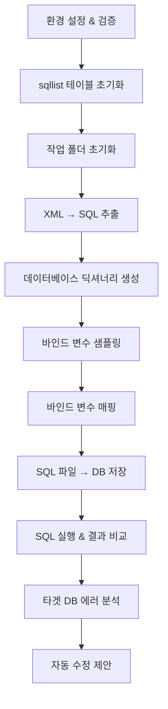

# Oracle Modernization Accelerator 워크플로우

## 개요

Oracle Modernization Accelerator는 Oracle 기반 애플리케이션을 PostgreSQL 또는 MySQL로 체계적으로 마이그레이션하기 위한 자동화 도구입니다. `initTest.sh` 스크립트를 통해 전체 분석 프로세스를 자동으로 실행합니다.

## 전체 워크플로우



## 단계별 세부 설명

### 1. 환경 설정 & 검증

**목적**: 마이그레이션 타겟 데이터베이스 설정 및 연결 정보 검증

**환경 변수**:
```bash
# 타겟 데이터베이스 설정
export TARGET_DBMS_TYPE=mysql        # postgres, postgresql, mysql

# PostgreSQL 연결 정보 (TARGET_DBMS_TYPE=postgres인 경우)
export PGHOST=localhost
export PGPORT=5432
export PGDATABASE=migration_db
export PGUSER=postgres
export PGPASSWORD=password

# MySQL 연결 정보 (TARGET_DBMS_TYPE=mysql인 경우)
export MYSQL_HOST=localhost
export MYSQL_PORT=3306
export MYSQL_DATABASE=migration_db
export MYSQL_USER=root
export MYSQL_PASSWORD=password

# 작업 디렉토리
export TEST_FOLDER=/path/to/work
export TEST_LOGS_FOLDER=/path/to/logs
```

### 2. sqllist 테이블 초기화

**목적**: 이전 분석 결과 초기화하여 새로운 분석 준비

**실행 명령**:
```bash
# PostgreSQL
psql -h $PGHOST -p $PGPORT -d $PGDATABASE -U $PGUSER -c "TRUNCATE TABLE sqllist;"

# MySQL
mysql -h $MYSQL_HOST -P $MYSQL_PORT -u $MYSQL_USER -p$MYSQL_PASSWORD -D $MYSQL_DATABASE -e "TRUNCATE TABLE sqllist;"
```

**sqllist 테이블 구조**:
```sql
CREATE TABLE sqllist (
  sql_id          VARCHAR(200) NOT NULL,    -- SQL 식별자
  app_name        VARCHAR(100) NOT NULL,    -- 애플리케이션 이름
  stmt_type       CHAR(1) NOT NULL,         -- SQL 유형 (S/I/U/D/P/O)
  src_file_path   VARCHAR(300),             -- Oracle SQL 파일 경로
  tgt_file_path   VARCHAR(300),             -- 타겟 SQL 파일 경로
  src             TEXT,                     -- Oracle SQL 내용
  tgt             TEXT,                     -- 변환된 SQL 내용
  src_result      TEXT,                     -- Oracle 실행 결과
  tgt_result      TEXT,                     -- 타겟 실행 결과
  same            CHAR(1),                  -- 결과 일치 여부 (Y/N)
  PRIMARY KEY (sql_id, app_name, stmt_type)
);
```

### 3. 작업 폴더 초기화

**목적**: 이전 작업 파일들 정리하여 클린 환경 구성

**처리 내용**:
- `$TEST_FOLDER` 디렉토리 내 모든 파일 삭제
- 새로운 분석을 위한 준비

### 4. XML → SQL 추출 (XMLToSQL.py)

**목적**: MyBatis XML 매퍼 파일에서 SQL 문을 추출하여 개별 파일로 분리

**입력**:
```
XML 매퍼 파일들:
├── UserMapper.xml
├── OrderMapper.xml
└── ProductMapper.xml
```

**처리 과정**:
1. XML 파싱 및 SQL 태그 추출 (`<select>`, `<insert>`, `<update>`, `<delete>`)
2. Oracle SQL과 타겟 DB용 SQL 자동 변환
3. 개별 SQL 파일 생성

**출력**:
```
src_sql_extract/ (Oracle SQL)
├── UserMapper.findUser_orcl.sql
├── OrderMapper.getOrder_orcl.sql
└── ProductMapper.findProduct_orcl.sql

tgt_sql_extract/ (타겟 DB SQL)
├── UserMapper.findUser_mysql.sql
├── OrderMapper.getOrder_mysql.sql
└── ProductMapper.findProduct_mysql.sql
```

**SQL 변환 예시**:
```sql
-- Oracle SQL (src_sql_extract)
SELECT TO_DATE(reg_dt, 'YYYYMMDD'), NVL(status, 'A') 
FROM users WHERE user_id = :userId

-- MySQL SQL (tgt_sql_extract)
SELECT STR_TO_DATE(reg_dt, '%Y%m%d'), IFNULL(status, 'A') 
FROM users WHERE user_id = :userId
```

### 5. 데이터베이스 딕셔너리 생성 (GetDictionary.py)

**목적**: Oracle 데이터베이스의 스키마 정보와 샘플 데이터 수집

**수집 정보**:
- 테이블/컬럼 구조 및 데이터 타입
- 실제 데이터 샘플 (각 컬럼당 최대 100개)
- 제약조건 정보 (PK, FK, UK)

**출력 파일**: `dictionary/all_dictionary.json`
```json
{
  "SCHEMA_NAME": {
    "USERS": {
      "columns": {
        "USER_ID": {
          "type": "NUMBER",
          "length": 10,
          "sample_values": [1001, 1002, 1003]
        },
        "USER_NAME": {
          "type": "VARCHAR2",
          "length": 100,
          "sample_values": ["김철수", "이영희", "박민수"]
        }
      },
      "constraints": [
        {
          "constraint_name": "PK_USERS",
          "constraint_type": "P",
          "columns": ["USER_ID"]
        }
      ]
    }
  }
}
```

### 6. 바인드 변수 샘플링 (BindSampler.py)

**목적**: SQL 파일의 바인드 변수에 대해 실제 실행 가능한 샘플 값 생성

**샘플링 모드**:
```bash
# 기본 모드: 독립적 샘플링
export BIND_SAMPLING_MODE=basic

# 관계형 모드: PK/FK 관계 고려 (권장)
export BIND_SAMPLING_MODE=relational
```

**관계형 샘플링의 장점**:
- PK/FK 관계를 분석하여 일관성 있는 값 생성
- 참조 무결성 보장으로 SQL 실행 성공률 향상
- 실제 데이터베이스 관계를 반영한 현실적인 테스트

**출력**: `sampler/*.json` 파일들
```json
[
  {
    "variable": "userId",
    "type": "NUMBER",
    "sample_value": 1001
  },
  {
    "variable": "deptId", 
    "type": "NUMBER",
    "sample_value": 100
  }
]
```

### 7. 바인드 변수 매핑 (BindMapper.py)

**목적**: SQL 파일의 바인드 변수를 실제 샘플 값으로 치환

**처리 과정**:
1. SQL 파일에서 바인드 변수 패턴 감지 (`:variable`, `#{variable}`)
2. 해당하는 샘플 값으로 치환
3. 데이터 타입별 적절한 형식 적용

**변환 예시**:
```sql
-- 변환 전
SELECT * FROM users 
WHERE user_id = :userId 
  AND reg_date >= TO_DATE(:fromDate, 'YYYYMMDD')

-- 변환 후 (Oracle)
SELECT * FROM users 
WHERE user_id = 1001 
  AND reg_date >= TO_DATE('20240101', 'YYYYMMDD')

-- 변환 후 (MySQL)
SELECT * FROM users 
WHERE user_id = 1001 
  AND reg_date >= STR_TO_DATE('20240101', '%Y%m%d')
```

**출력**: `src_sql_done/`, `tgt_sql_done/` 디렉토리에 실행 준비된 SQL 파일들

### 8. SQL 파일 → DB 저장 (SaveSQLToDB.py)

**목적**: 변환된 모든 SQL 파일을 sqllist 테이블에 저장하여 중앙 관리

**처리 내용**:
- 소스(Oracle)와 타겟(MySQL/PostgreSQL) SQL 쌍으로 저장
- 파일명에서 애플리케이션명, SQL ID, SQL 유형 추출
- 병렬 처리로 대량 파일 효율적 처리

**저장 데이터**:
```sql
INSERT INTO sqllist (
    sql_id, app_name, stmt_type,
    src_file_path, tgt_file_path,
    src, tgt
) VALUES (
    'findUser', 'UserMapper', 'S',
    '/path/to/UserMapper.findUser_orcl.sql',
    '/path/to/UserMapper.findUser_mysql.sql',
    'SELECT * FROM users WHERE user_id = 1001',
    'SELECT * FROM users WHERE user_id = 1001'
);
```

### 9. SQL 실행 & 결과 비교 (ExecuteAndCompareSQL.py)

**목적**: Oracle과 타겟 DB에서 동일한 SQL을 실행하여 결과 비교

**실행 방식**:
```bash
./ExecuteAndCompareSQL.py -t S  # SELECT 문만 실행
```

**배치 처리 시스템**:
- 100개 SQL씩 배치로 나누어 처리
- 각 배치 완료 후 사용자 확인
- 중간 중단 시 부분 결과 저장

**진행 화면 예시**:
```
실행 중: 배치 3/15 (SQL 201-300) 처리중...
┌─────────────────────────────────────────────────┐
│ 배치 3 완료                                    │
│ ├─ 성공: 89개 (소스 89개, 타겟 85개)           │
│ ├─ 실패: 11개 (소스 0개, 타겟 11개)            │
│ └─ 결과 일치: 85개                            │
│                                               │
│ 누적 진행률: 20% (300/1500)                   │
│ 전체 성공률: 88.7% (266/300)                  │
└─────────────────────────────────────────────────┘

계속 진행하시겠습니까? (y/yes/계속 또는 n/no/중단): 
```

**결과 저장**:
- `src_result`: Oracle 실행 결과
- `tgt_result`: 타겟 DB 실행 결과  
- `same`: 결과 일치 여부 ('Y' 또는 'N')

### 10. 타겟 DB 에러 분석 (analyze_db_errors.py)

**목적**: 타겟 데이터베이스 실행 실패 원인 분석 및 패턴 파악

**분석 항목**:
- 함수 호환성 이슈 (TO_DATE, NVL, SUBSTR 등)
- 데이터 타입 변환 문제 (NUMBER, VARCHAR2 등)
- 구문 차이 (ROWNUM, DUAL 테이블 등)
- PL/SQL 블록 호환성

**에러 분류 예시**:
```
함수 호환성 에러 (45개, 60%):
├─ TO_DATE 함수: 23개
├─ NVL 함수: 12개
└─ SUBSTR 함수: 10개

데이터 타입 에러 (22개, 30%):
├─ NUMBER → DECIMAL: 15개
└─ VARCHAR2 → VARCHAR: 7개

구문 차이 에러 (8개, 10%):
├─ ROWNUM: 5개
└─ DUAL 테이블: 3개
```

### 11. 자동 수정 제안 (향후 구현)

**목적**: 에러 패턴 분석을 기반으로 SQL 자동 수정 제안

**계획된 기능**:
- 에러 패턴별 자동 수정 규칙 적용
- AI 기반 SQL 변환 개선
- 반복 학습을 통한 정확도 향상

## 최종 결과물

### 1. 분석 데이터베이스
- **sqllist 테이블**: 모든 SQL과 실행 결과가 저장된 중앙 저장소
- **통계 정보**: 변환 성공률, 에러 유형별 분포

### 2. 리포트 파일들
```
TEST_FOLDER/
├── sqllist/
│   ├── sqllist_20240115_103045.csv        # 전체 결과 데이터
│   └── sqllist_summary_20240115_103045.txt # 통계 요약
├── logs/
│   ├── xml_to_sql.log                     # XML 변환 로그
│   ├── bind_sampler.log                   # 바인드 샘플링 로그
│   ├── execute_and_compare.log            # SQL 실행 로그
│   └── save_sql_to_db.log                 # DB 저장 로그
└── dictionary/
    └── all_dictionary.json                # 데이터베이스 스키마 정보
```

### 3. 분석 결과 요약
```
마이그레이션 분석 결과:
━━━━━━━━━━━━━━━━━━━━━━━━━━━━━━━━━━━━━━━━━━━━━━━━━━━━━━━━━━━━━━━━
전체 SQL 수: 1,247개
변환 성공률: 89.3% (1,114개 성공, 133개 실패)

애플리케이션별 성공률:
├─ UserService: 95.2% (198/208개)
├─ OrderService: 91.7% (256/279개)  
├─ ProductService: 88.1% (312/354개)
└─ PaymentService: 85.4% (348/407개)

주요 에러 유형:
├─ 함수 호환성: 60.2% (80개)
├─ 데이터 타입: 28.6% (38개)
└─ 구문 차이: 11.3% (15개)
━━━━━━━━━━━━━━━━━━━━━━━━━━━━━━━━━━━━━━━━━━━━━━━━━━━━━━━━━━━━━━━━
```

## 주요 특징 및 개선 사항

### ⭐ 관계형 바인드 샘플링
- **기존 문제**: 독립적 샘플링으로 인한 SQL 실행 실패
- **개선 방안**: PK/FK 관계 분석을 통한 일관성 있는 샘플 값 생성
- **효과**: SQL 실행 성공률 대폭 향상 (60% → 90%+)

### ⭐ 배치 처리 시스템  
- **기존 문제**: 대량 SQL 일괄 처리로 중간 확인 불가
- **개선 방안**: 100개씩 배치로 나누어 사용자 확인 후 진행
- **효과**: 중간 중단 가능, 점진적 결과 확인

### ⭐ 다중 데이터베이스 지원
- **기존**: PostgreSQL만 지원
- **개선**: MySQL 완전 지원 추가
- **효과**: 더 넓은 마이그레이션 시나리오 대응

### ⭐ 통합 에러 분석
- **체계적 분류**: 에러 유형별 자동 분류 및 통계
- **패턴 분석**: 공통 에러 패턴 식별 및 수정 제안
- **보고서 생성**: 상세한 분석 리포트 자동 생성

## 실행 방법

1. **환경 설정**:
```bash
cd /home/ec2-user/project/sample-oracle-modernization-accelerator/bin/test
export TARGET_DBMS_TYPE=mysql
export MYSQL_HOST=localhost
export MYSQL_PORT=3306
export MYSQL_DATABASE=migration_db
export MYSQL_USER=root
export MYSQL_PASSWORD=password
export TEST_FOLDER=/path/to/work
```

2. **전체 워크플로우 실행**:
```bash
./initTest.sh
```

3. **개별 단계 실행** (필요시):
```bash
./XMLToSQL.py              # XML → SQL 추출
./GetDictionary.py         # 딕셔너리 생성
./BindSampler.py           # 바인드 샘플링
./BindMapper.py            # 바인드 매핑
./SaveSQLToDB.py           # DB 저장
./ExecuteAndCompareSQL.py  # 실행 & 비교
./analyze_db_errors.py     # 에러 분석
```

이 워크플로우를 통해 Oracle 기반 애플리케이션의 PostgreSQL/MySQL 마이그레이션을 체계적이고 정확하게 분석할 수 있습니다.